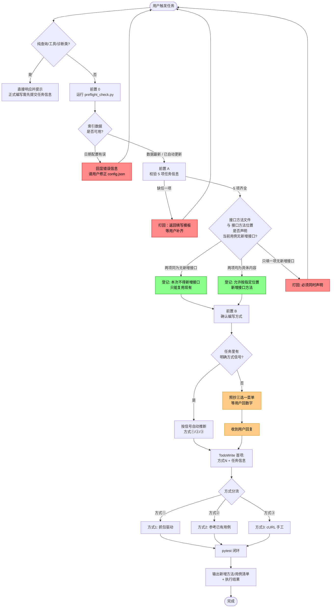
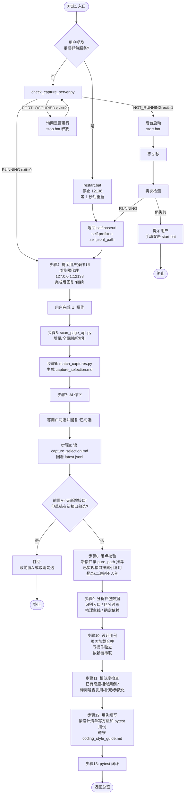
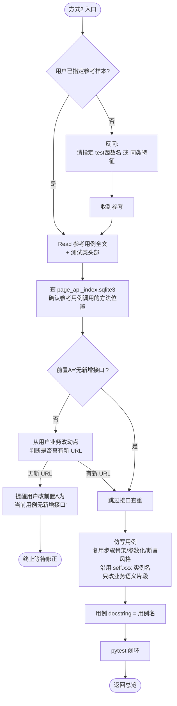
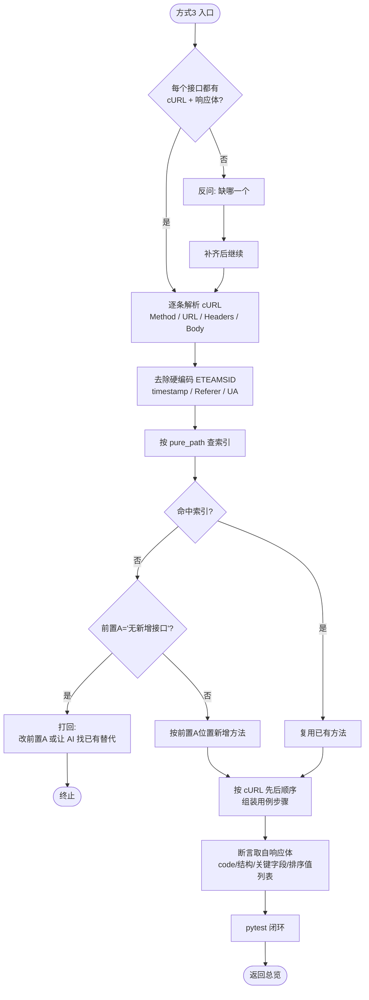
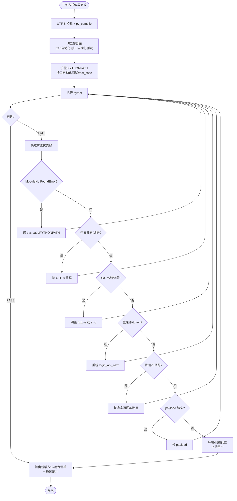
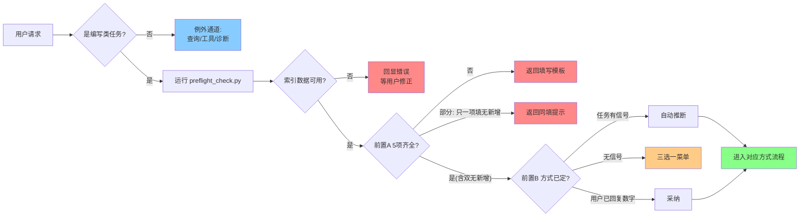
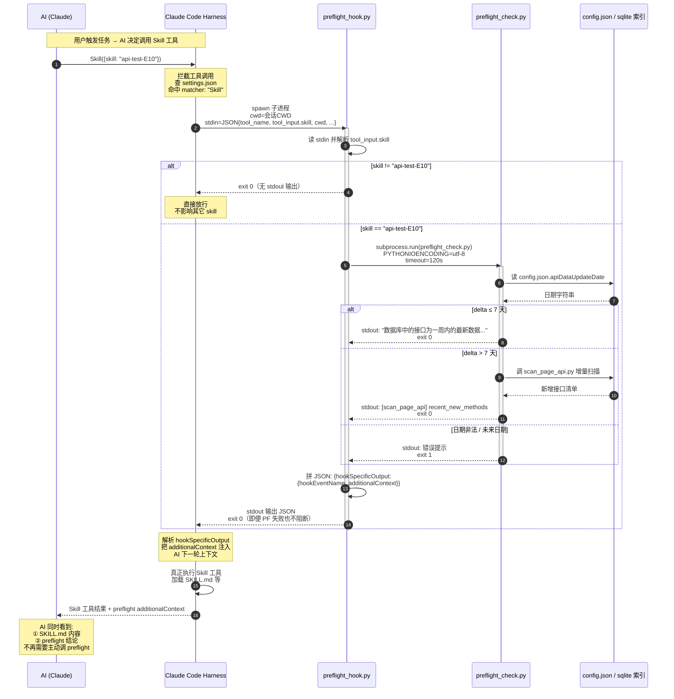

# api-test-E10 执行流程图

本文件使用 [Mermaid](https://mermaid.js.org/) 绘制。VSCode / GitHub / Obsidian / Typora 等均可直接渲染。

> 三种方式的详细执行方案已拆分到 `doc/mode_capture_driven.md`、`doc/mode_reference_case.md`、`doc/mode_curl_manual.md`；本文件仅维护流程图与决策关系。

---

## 一、总览（入口流程）

---

## 二、方式①：抓包驱动

### 方式① 关键动作与产物

| 步骤 | 动作 | 产物/输出 |
|---|---|---|
| 1 | 判断是否需要重启 | 用户是否明确提及重启抓包服务 |
| 2 | 二选一处理抓包服务 | 重启：`restart.bat`；未重启：检查端口并按需 `start.bat` |
| 3 | 返回服务信息 | `self.baseurl` / `self.prefixes` / `self.jsonl_path` |
| 4 | 提示用户操作 UI | 浏览器代理与证书提示，完成后回复“继续” |
| 5 | 刷新索引 | `tools/page_api_index.sqlite3` |
| 6 | 生成草稿 | `api_test_dwp_temp/capture_selection.md` |
| 7 | 等用户勾选 | `[x]/[ ]` 标记，AI 不得擅自续跑 |
| 8 | 读勾选结果与落点校验 | 只处理用户确认勾选接口；新接口校验前置 A，已实现接口按索引复用 |
| 9 | 分析抓包数据 | 入口请求、读写类型、业务主线、接口依赖关系 |
| 10 | 设计用例 | 页面加载合并，写操作独立，依赖链串联 |
| 11 | 相似度检查 | 高度相似用例处理建议，按用户确认复用/补充/参数化 |
| 12 | 用例编写 | 新方法写入 `[接口方法文件]`，新用例写入 `[接口用例文件]` |
| 13 | pytest 闭环 | 执行日志 + 通过/失败统计 |

---

## 三、方式②：参考已有用例

### 方式② 关键原则（禁止行为）

| 动作 | 是否允许 |
|---|---|
| 为新用例增加参考没有的能力（如分组、排序） | ❌ 禁止 |
| 把简化参考改成复杂版本 | ❌ 禁止 |
| 为新用例挂 `@pytest.mark.skip` | ❌ 除非用户声明"写占位" |
| 引入参考用例没有的 API 实例 | ❌ 禁止 |
| 修改参考用例本身 | ❌ 禁止（除非用户要求） |

---

## 四、方式③：cURL 手工

### 方式③ cURL 处理清单

| cURL 项 | 处理方式 |
|---|---|
| `-X GET/POST/PUT/DELETE` | 作为接口方法的 method 参数 |
| `--url "https://host/api/xxx?a=1"` | 拆 pure_path + query 参数 |
| `-H "Cookie: ETEAMSID=xxxx"` | 删除硬编码，改用 `login_api_new` 动态获取 |
| `-H "Content-Type: application/json"` | 保留 |
| `-H "Referer: ..."` / `-H "User-Agent: ..."` | 删除，不写入方法 |
| `-d '{"a":1,"timestamp":...}'` | `timestamp/_t` 改为调用时生成 |
| `--data-urlencode` | 按 form 编码落入 payload |

---

## 五、pytest 闭环（三方式共用）

---

## 六、三方式对比速查

| 维度 | 方式1 抓包 | 方式2 参考 | 方式3 cURL |
|---|---|---|---|
| 典型场景 | 新接口多 / 复杂链路 | 同类用例批量 / 修改参数 | 抓包不可用 / 数据过多 |
| 用户准备成本 | 低（UI 操作即可） | 中（指定参考） | 高（收集 cURL + 响应） |
| 新接口能力 | ✅ 索引驱动查重 | ⚠️ 默认不新增，必要时新增 | ✅ 按 cURL 新增 |
| AI 主观判断 | 低（索引 + 草稿） | 中（仿写需理解参考） | 中（需理解 cURL 语义） |
| 最常见失败 | 登录态 / 浏览器代理 | 参考样本选错 | cURL 不全 / 响应缺失 |
| 闭环严格度 | 强（草稿必停等） | 强（参考必 Read） | 强（cURL+响应必配对） |

---

## 七、前置 0 / 前置 A / 前置 B 决策闸门

---

## 八、本流程图与 SKILL.md 的对应关系

| 流程图章节 | SKILL.md 对应章节 |
|---|---|
| 一、总览 | 🚨 前置必跑 0 + 前置必填 A + B |
| 二、方式① | ① 方式1：抓包驱动（推荐） |
| 三、方式② | ② 方式2：参考已有用例（推荐） |
| 四、方式③ | ③ 方式3：cURL 手工（补充） |
| 五、pytest 闭环 | 核心原则 → 5. 测试必须闭环 |
| 六、对比速查 | 三种方式的共用规范 |
| 七、决策闸门 | 前置必跑 0 + 前置必填 A / B 校验规则 |
| 附录 A、Hook 触发时序 | 🚨 前置必跑 0（由 hook 自动执行）+ 项目级 `.claude/settings.json` 的 `hooks.PreToolUse` |

---

## 九、维护说明

- 本文件与 `SKILL.md` 保持**双向一致**：修改任一侧流程，另一侧必须同步
- Mermaid 语法兼容性优先 GitHub 与 VSCode 的 Mermaid 插件
- 如流程图需要导出为图片，推荐 [Mermaid Live Editor](https://mermaid.live/)

---

## 附录 A、PreToolUse Hook 触发时序图

描述 AI 调用 `Skill({skill: "api-test-E10"})` 时，Claude Code 如何同步拦截、spawn `preflight_hook.py`、并把 `preflight_check.py` 的结果注入 AI 上下文的完整链路。

> 配套实现：`hooks/preflight_hook.py` + 项目级 `.claude/settings.json` 的 `hooks.PreToolUse.matcher="Skill"`。

### 关键时序约束（看图配套说明）

| 步骤 | 同步/异步 | 失败处理 |
|---|---|---|
| ②→③ harness 调用 hook | **同步阻塞** | Skill 工具不执行直到 hook 退出 |
| ④ hook 解析 stdin | 同步 | JSON 解析失败 → 直接 exit 0 放行 |
| ⑤ skill 名过滤 | 同步 | 不匹配 → 立即 exit 0，不跑 PF |
| ⑥→⑩ spawn preflight | 同步阻塞 | timeout=120s；超时 → 注入诊断信息但 exit 0 |
| ⑪ JSON 输出 | 同步 | 永远 exit 0（PF 失败也不阻断 Skill） |
| ⑫ 注入 additionalContext | 由 harness 处理 | 作为 system 消息进 AI 上下文 |

### 关键设计取舍

- **永不阻断**：即便 preflight 自己崩了，hook 也 exit 0；宁可让 AI 看到诊断信息自行判断，也不要因 hook 故障让 skill 整个不可用。如需强制阻断，把 hook 末尾改成按 `result.returncode` 决定 exit 2。
- **二次过滤放在脚本里**：`matcher: "Skill"` 在 settings 层只能按工具名匹配，无法区分具体 skill 名；脚本内 `skill_name == "api-test-E10"` 这层过滤是必须的，否则任何 Skill 调用都会触发 preflight。
- **CWD 取 payload.cwd**：preflight 子进程的 CWD 是用户会话 CWD（消费方项目），不是 hook 脚本所在目录——这样 `skill_utils/project_root.py` 的 fallback 路径搜索能正确落到消费方项目。

